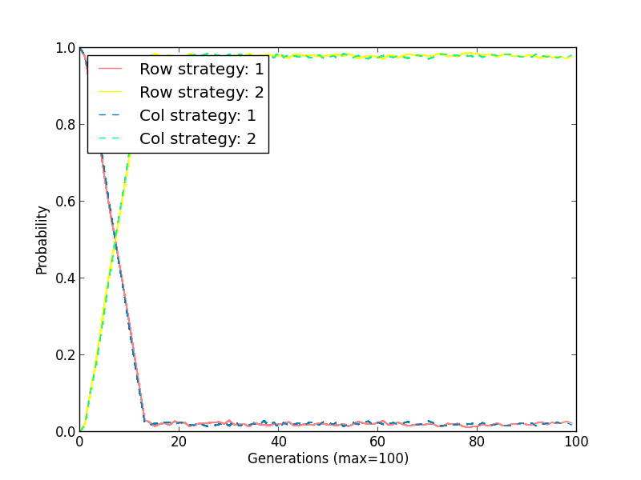

# [Gamepy: some python code for game theory...](../index.html)

## Abm.py

Abm.py contains some code to run agent based simulations of normal form games. This allows for nice visualisations of emergent behaviour in game theoretical contexts. The pseudo code for the main procedure in this file is given below:

~~~~{.pseudo}
Create row agents corresponding to row strategies
Create col agents corresponding to col strategies

for every generation:
    for every round of tournament:
        randomly dual row agents against col agents

    remove week agents
    reproduce strong agents (allowing for mutation)
~~~~

A great explanation of these sort of things is available in [this book](http://goo.gl/jDvY7) by Herbert Gintis.

## Usage
Create an agent based model instance by passing a variety of arguments:

~~~~{.python}
ABM(number_of_agents=INT, generations=INT, rounds_per_generation=INT, death_rate=FLOAT, mutation_rate=FLOAT,
row_matrix=LIST, col_matrix=LIST, [initial_strategy_distribution=LIST])
~~~~

Here is an example (taking a look at the Prisoner's Dilemma):

~~~~{.python}
import Abm
number_of_agents = 1000
generations = 100
rounds_per_generation = 5
death_rate = .1
mutation_rate = .2
row_matrix = [[4, 0], [5, 2]]
col_matrix = [[4, 5], [0, 2]]

g = Abm.ABM(number_of_agents, generations, rounds_per_generation, death_rate, mutation_rate, row_matrix, col_matrix)
~~~~

We run the simulation using the `simulate` method:

~~~~{.python}
g.simulate()
~~~~

Here's some of the output which shows the first and last two generations:

~~~~{.bash}
----------------------

Generation: 1 of 100
    Round: 1 of 5
    Round: 2 of 5
    Round: 3 of 5
    Round: 4 of 5
    Round: 5 of 5

Row players strategy distribution:
    [0.506, 0.494]

Col players strategy distribution:
    [0.481, 0.519]

----------------------

...

----------------------

Generation: 99 of 100
    Round: 1 of 5
    Round: 2 of 5
    Round: 3 of 5
    Round: 4 of 5
    Round: 5 of 5

Row players strategy distribution:
    [0.027, 0.973]

Col players strategy distribution:
    [0.019, 0.981]

----------------------

Generation: 100 of 100
    Round: 1 of 5
    Round: 2 of 5
    Round: 3 of 5
    Round: 4 of 5
    Round: 5 of 5

Row players strategy distribution:
    [0.016, 0.984]

Col players strategy distribution:
    [0.02, 0.98]
~~~~

We see that the population is tending to the "Defect" strategy (as expected).

If the user has the excellent python plotting package [matplotlib](http://matplotlib.org/) the simulation can be run with dynamic plotting (ie updates as the simulation is run):

~~~~{.python}
g.simulate(plot=True)
~~~~

The plot is shown here:

We see that the populations started uniformly distributed amongst the strategies. We can however pass an initial distribution to the ABM class:

~~~~{.python}
number_of_agents = 1000
generations = 100
rounds_per_generation = 5
death_rate = .1
mutation_rate = .2
row_matrix = [[4, 0], [5, 2]]
col_matrix = [[4, 5], [0, 2]]
initial_distribution = [{0: 100, 1: 0}, {0:100, 1:0}]

g = Abm.ABM(number_of_agents, generations, rounds_per_generation, death_rate, mutation_rate, row_matrix, col_matrix, initial_distribution)
~~~~

The output plot clearly shows how the populations begin by cooperating but quickly converge to defecting:

## Comments and issues

Note that to use the plot ability of the simulate method you need to have [matplotlib](http://matplotlib.org/) installed.

Choice of parameters is important in these sorts of experiments so be sure to play around with a variety of them. From a theoretical point of view note that an Evolutionary Stable Strategy does not necessarily imply Nash equilibria.
